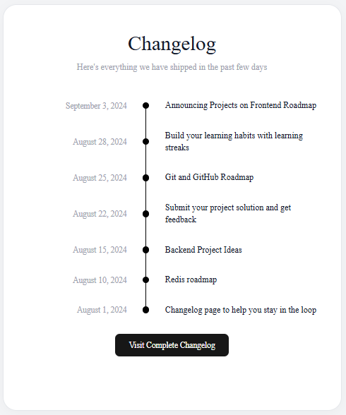

# Changelog Project

A simple changelog webpage built with HTML and CSS. This project is part of the roadmap.sh frontend projects and focusses on creating a clean, responsive changelog layout.

## Preview

## Features

- Responsive design
- Semantic HTML
- Clean and modern UI
- CSS styling

## Technologies Used

- HTML5
- CSS3

## Project URL
https://roadmap.sh/projects/changelog-component